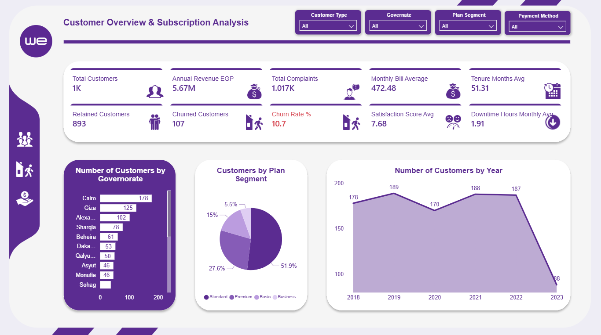
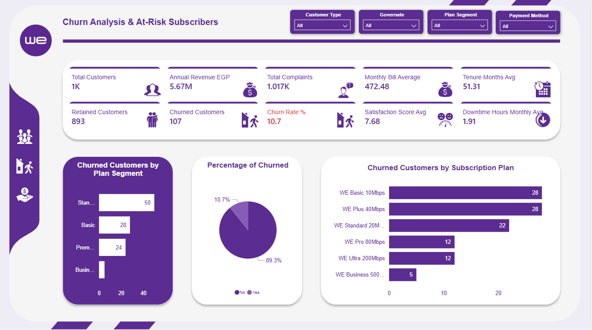
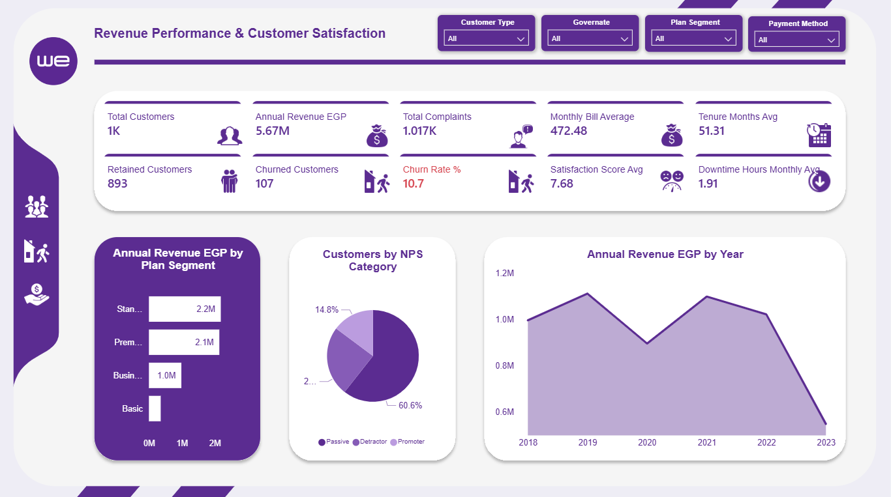

# 📡 Telecom Egypt (WE) — Customer Analytics Power BI Dashboard

> A 3-page interactive Power BI dashboard analyzing Telecom Egypt (WE) customer data — covering subscription analysis, churn detection, revenue performance, and customer satisfaction across Egyptian governorates.

---

## 📌 Project Overview

This project analyzes a synthetic dataset of **1,000 WE Telecom Egypt customers** using Power BI, delivering actionable insights across three strategic dimensions: customer overview & subscriptions, churn analysis, and revenue performance & satisfaction.

| Detail | Info |
|---|---|
| **Tool** | Microsoft Power BI |
| **Brand** | WE — Telecom Egypt |
| **Dataset** | 1,000 customers (synthetic) |
| **Annual Revenue** | EGP 5.67M |
| **Churn Rate** | 10.7% |
| **Pages** | Customer Overview · Churn Analysis · Revenue & Satisfaction |
| **Filters** | Customer Type · Governorate · Plan Segment · Payment Method |

---

## 📊 Dashboard Pages

### Page 1 — Customer Overview & Subscription Analysis

Full customer picture across all governorates and subscription plans:

| KPI | Value |
|---|---|
| Total Customers | 1,000 |
| Annual Revenue | EGP 5.67M |
| Total Complaints | 1,017 |
| Monthly Bill Average | EGP 472.48 |
| Retained Customers | 893 |
| Churned Customers | 107 |
| Churn Rate | **10.7%** |
| Satisfaction Score Avg | 7.68 / 10 |
| Avg Tenure | 51.31 months |
| Avg Downtime | 1.91 hrs/month |

**Cairo** leads with 178 customers, followed by Giza (125) and Alexandria (102). **Standard plan** dominates at 51.9% of subscribers. Customer count peaked in 2019 (189) and dropped sharply in 2023 (88).

---

### Page 2 — Churn Analysis & At-Risk Subscribers

Deep-dive into the **10.7% churn rate** across plan segments and subscription plans:

- **Standard plan** has the highest churn at **50 customers**
- **WE Basic 10Mbps** and **WE Plus 40Mbps** tie for most churned plans at **28 each**
- **89.3%** of customers are retained — churn is concentrated in lower-tier plans
- Business segment has near-zero churn — highest loyalty among plan types

---

### Page 3 — Revenue Performance & Customer Satisfaction

Revenue breakdown and NPS satisfaction analysis:

- **Standard plan** generates the most revenue at **EGP 2.2M**, followed by Premium at **EGP 2.1M**
- **60.6% of customers are Passive** on the NPS scale — a retention risk signal
- **Promoters represent only 14.8%** — room for satisfaction improvement
- Revenue peaked in **2019 (~EGP 1.1M)** and declined sharply through 2023

---

## 💡 Key Insights

- 📉 **Churn rate: 10.7%** — 107 customers lost, mainly from Standard and Basic plans
- 💰 **Annual Revenue: EGP 5.67M** — Standard and Premium plans contribute ~78%
- 🏙️ **Cairo leads** in customer count (178), followed by Giza and Alexandria
- 📅 **Sharp decline in 2023** (only 88 new customers) — a significant business risk signal
- 😐 **60.6% Passive NPS** — majority are neither loyal promoters nor active detractors
- ⚡ **Avg downtime: 1.91 hrs/month** — quality metric worth monitoring
- 🏆 **Business segment** has the lowest churn — highest loyalty tier

---

## 🛠️ Tools & Techniques

- **Microsoft Power BI** — 3-page interactive report with navigation sidebar
- **DAX** — Churn rate %, retention counts, revenue aggregations, NPS classification
- **Custom Theme** — WE brand colors (purple palette) via JSON theme file
- **Data Modeling** — Customer, subscription, payment, and governorate relationships
- **Visualizations** — KPI cards with icons, Bar charts, Pie charts, Area chart (time series)
- **Filters** — Customer Type · Governorate · Plan Segment · Payment Method

---

## 📁 Files in This Repo

| File | Description |
|---|---|
| `we_data_set.pbix` | Full Power BI report (3 pages) |
| `Telecom_Egypt_Customer_Dataset.xlsx` | Synthetic customer dataset (1,000 rows) |
| `Power_BI_Theme_by_BIBB.json` | Custom WE brand color theme |
| `We_data.mp4` | Dashboard walkthrough video |
| `1.png` | Page 1 — Customer Overview & Subscription Analysis |
| `2.png` | Page 2 — Churn Analysis & At-Risk Subscribers |
| `3.png` | Page 3 — Revenue Performance & Customer Satisfaction |

---

## 🚀 How to Use

1. Download `we_data_set.pbix`
2. Open in **Microsoft Power BI Desktop**
3. Use the **sidebar icons** to navigate between the 3 pages
4. Apply filters: **Customer Type / Governorate / Plan Segment / Payment Method**
5. Watch `We_data.mp4` for a full dashboard walkthrough

---

## 👤 Author

**Belal Farrag** — Data Analyst

